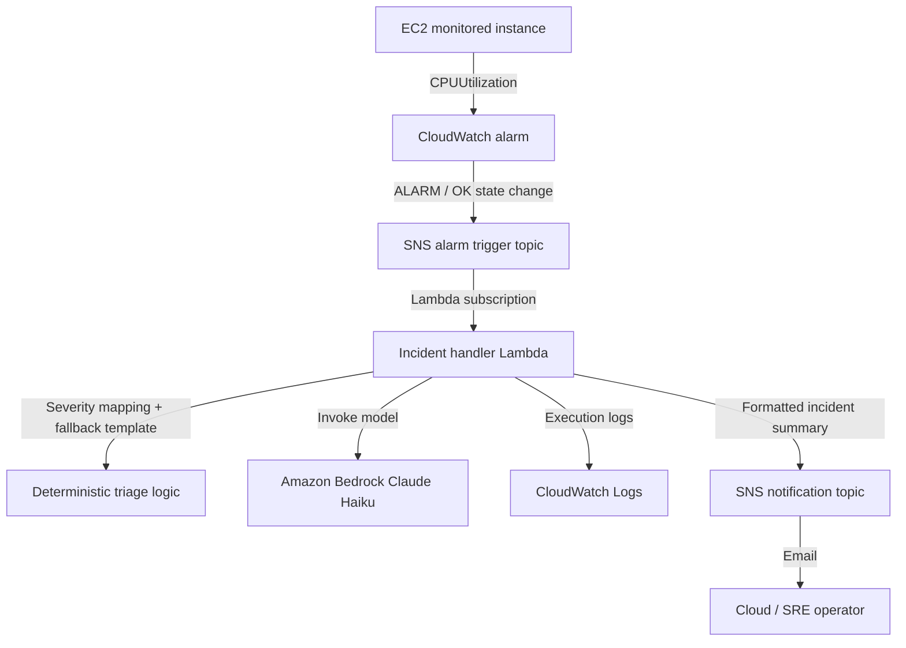

# AWS Incident Triage Pipeline

AWS Incident Triage Pipeline is an event-driven cloud operations workflow that turns CloudWatch alarm events into structured incident summaries. It follows the first response path I am used to from operations work: detect a metric breach, pull out the context, generate a focused triage summary, and notify an operator.

This project connects my production operations background with cloud-native incident response. It is intentionally small, but it includes the pieces I care about in real operations work: alarm context, least-privilege IAM, fallback handling, useful notifications, and repeatable infrastructure. Amazon Bedrock is used as an assistive triage layer, while deterministic fallback handling keeps the workflow usable if model output is unavailable or too generic.

## What It Does

- Monitors EC2 CPU utilization with Amazon CloudWatch alarms
- Sends alarm state changes to an SNS trigger topic
- Invokes a Python Lambda incident handler
- Calculates deterministic severity from alarm state, threshold, and current value before the Bedrock step
- Calls Amazon Bedrock to generate a remediation-focused triage summary
- Publishes the final incident notification through a separate SNS email topic
- Stores Lambda execution logs in CloudWatch Logs
- Provisions the full workflow with Terraform
- Runs Lambda unit tests, Terraform validation, Bandit, and Checkov in GitHub Actions

## Architecture



## Tech Stack

| Layer | Technology |
|---|---|
| Compute | EC2, AWS Lambda |
| Monitoring | CloudWatch alarm, CloudWatch Logs |
| Messaging | Amazon SNS |
| Triage summary | Amazon Bedrock Claude Haiku |
| Infrastructure | Terraform |
| Validation | GitHub Actions, Python unit tests, Bandit, Checkov |

## Repository Structure

```text
.
├── lambda/
│   └── incident_handler.py
├── tests/
│   └── test_incident_handler.py
├── docs/
│   └── runbook.md
├── assets/
│   └── bedrock-incident-email.png
├── .github/workflows/
│   └── terraform-validate.yml
├── main.tf
├── provider.tf
├── variables.tf
├── outputs.tf
├── terraform.tfvars.example
└── test-alarm.json
```

## Incident Handler Behavior

The Lambda function:

- Extracts alarm name, metric, threshold, state, instance ID, region, timestamp, and current datapoint from the CloudWatch alarm payload
- Maps severity deterministically before calling Bedrock, so notifications still have useful triage context during model failures
- Prompts Bedrock to produce a concise summary, likely cause, immediate actions, and severity
- Rejects short or generic model responses and falls back to a deterministic incident template
- Sends a final incident email through SNS
- Sends a fallback failure notification if alarm processing fails

## Validation Modes

### Safe Manual Test

Use the included sample payload to test the Lambda/SNS/Bedrock flow without waiting for a real CPU alarm:

```bash
aws sns publish \
  --topic-arn <alarm-trigger-topic-arn> \
  --message file://test-alarm.json \
  --region us-east-1
```

### Real CloudWatch Alarm Test

For a short validation run, enable the optional startup CPU load loop:

```hcl
enable_startup_cpu_stress  = true
startup_cpu_stress_seconds = 300
```

This runs temporary CPU load on the EC2 instance after boot so the CloudWatch alarm can move into `ALARM`. Keep this disabled for normal deployments.

## Incident Email Screenshot

The system sends a Bedrock-assisted incident email after the alarm event is processed.


## Quick Start

```bash
git clone https://github.com/krishna310301/aws-incident-triage-pipeline.git
cd aws-incident-triage-pipeline
cp terraform.tfvars.example terraform.tfvars
```

Edit `terraform.tfvars`:

```hcl
aws_region          = "us-east-1"
notification_email  = "your-email@example.com"
cpu_alarm_threshold = 70
bedrock_model_id    = "us.anthropic.claude-haiku-4-5-20251001-v1:0"
```

Deploy:

```bash
terraform init
terraform plan
terraform apply
```

After deployment:

1. Confirm the SNS email subscription.
2. Run the manual SNS test or enable the short CPU stress validation.
3. Check the incident email notification.
4. Review Lambda logs:

```bash
aws logs tail /aws/lambda/aws-incident-triage-pipeline-incident-handler \
  --region us-east-1 \
  --since 10m
```

## Local Validation

```bash
PYTHONPATH=. python -m unittest discover -s tests -v
terraform fmt -check
terraform init -backend=false
terraform validate
```

GitHub Actions also runs Bandit against the Lambda handler and Checkov against the Terraform configuration.

Operational response notes are documented in [docs/runbook.md](docs/runbook.md).

## Security Notes

- Terraform state files and local variable files are excluded from version control.
- The EC2 security group has outbound access only; no inbound rules are created.
- IMDSv2 is enforced on the monitored EC2 instance.
- Lambda permissions are scoped to CloudWatch Logs, the notification SNS topic, and the configured Bedrock resources.
- Bedrock Marketplace read/subscribe permissions use `Resource = "*"` because model access activation can require account-level Marketplace APIs.
- The project uses the default VPC intentionally for low-cost validation. A production version should use a dedicated VPC, private subnets, VPC endpoints, and stricter egress controls.

## Cleanup

This project creates cost-bearing resources such as EC2 and Bedrock invocations. Destroy the environment after validation:

```bash
terraform destroy
```

## Future Improvements

- Add Systems Manager Session Manager for secure instance access
- Store incident history in DynamoDB
- Add Slack or Microsoft Teams notification integration
- Add EventBridge routing for multi-alarm workflows
- Move the monitored instance into a dedicated private subnet
